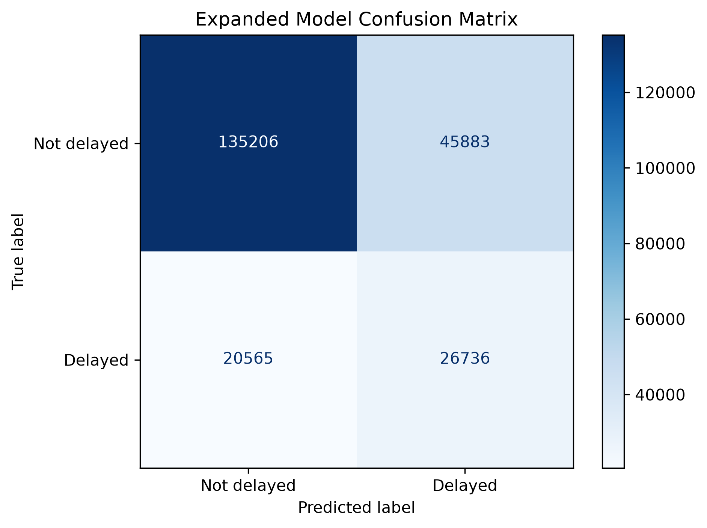
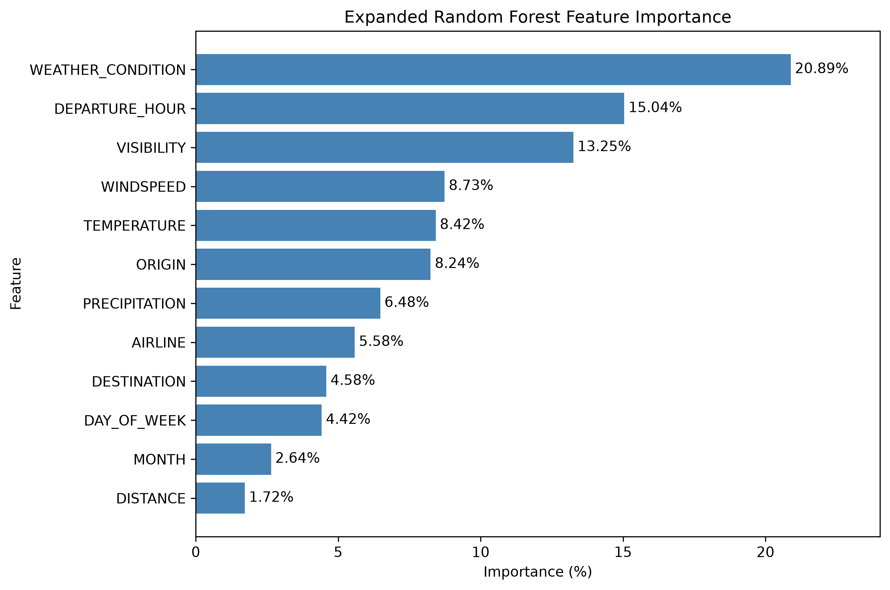

# Flight Delay Prediction Model Using SQL and Python

An exploratory aviation analytics project that combines US domestic flight records with daily airport weather data to classify whether a flight will arrive at least 15 minutes late.

The project was built as a beginner-friendly, end-to-end machine-learning workflow. SQL is used for data inspection, cleaning, validation, joining, and exploratory analysis. Python is used for feature engineering, visualization, model training, evaluation, and a simple delay-risk predictor.

## Project Objective

The analysis asks:

> How much flight-delay risk can be identified from airline, route, scheduled departure time, calendar information, distance, and daily origin-airport weather?

The final output is an exploratory risk model rather than an operational flight forecast. It returns Low, Medium, or High relative delay risk for a supplied flight scenario.

## Data Sources

- [Bureau of Transportation Statistics (BTS) Reporting Carrier On-Time Performance](https://www.transtats.bts.gov/DL_SelectFields.aspx?QO_fu146_anzr=&gnoyr_VQ=FGJ): flight-level records for January-April 2025.
- [NOAA NCEI Global Summary of the Day (GSOD)](https://www.ncei.noaa.gov/access/search/datasets/global-summary-of-the-day/): daily weather observations for 20 major US origin airports.

The BTS target column is `ARR_DEL15`, where `1` indicates an arrival delay of at least 15 minutes and `0` indicates no qualifying delay.

## Data Scope

| Stage | Rows | Coverage |
|---|---:|---|
| Combined BTS flight data | 2,229,453 | 333 origin airports |
| Cleaned flight data | 2,188,776 | Completed, non-diverted flights with valid model fields |
| Cleaned NOAA weather data | 2,400 | 20 airports x 120 days |
| Final merged dataset | 1,141,948 | 20 origin airports, January 1-April 30, 2025 |

The flight and weather tables were joined with an `INNER JOIN` on flight date and origin airport. This intentionally retained only flights with matching weather observations.

## Tools

- SQLite and SQL
- Python
- pandas
- scikit-learn
- matplotlib
- Jupyter notebooks in Visual Studio Code

## Workflow

1. Combined four monthly BTS files into one flight-level dataset.
2. Downloaded and combined NOAA GSOD files for the 20 busiest origin airports in the flight data.
3. Loaded the raw flight and weather datasets into SQLite.
4. Inspected schemas, row counts, date coverage, missing values, blank values, duplicates, invalid ranges, and NOAA sentinel values.
5. Created `flights_cleaned` and `weather_cleaned` tables.
6. Joined both tables into `merged_flight_weather` using origin airport and date.
7. Performed focused SQL and Python exploratory analysis.
8. Created a stratified 80/20 train-test split and one-hot encoded categorical features.
9. Trained and compared two class-balanced Random Forest models.
10. Evaluated accuracy, precision, recall, F1-score, confusion matrices, and feature importance.
11. Built a function that converts the final model score into Low, Medium, or High relative delay risk.

## Data Cleaning

The SQL cleaning process:

- removed cancelled and diverted flights;
- retained rows with a valid binary arrival-delay status;
- validated month, day, scheduled departure time, and distance ranges;
- standardized carrier and airport codes;
- converted scheduled departure time into `DEPARTURE_HOUR`;
- created a `ROUTE` field from origin and destination;
- checked duplicate flight candidates using date, tail number, carrier, route, and scheduled time;
- converted documented NOAA missing-value sentinels to `NULL`;
- standardized NOAA weather flags as six-character condition codes;
- validated that each airport-date weather key was unique.

Actual departure times, arrival-delay minutes, and delay-cause columns were excluded from the model to prevent target leakage.

## Exploratory Findings

- Delayed flights represented 20.71% of the final dataset, creating an imbalanced classification problem.
- Delay rates generally increased later in the day and peaked during the evening.
- Flights on days with measurable precipitation had a 27.36% delay rate, compared with 18.15% on days without measurable precipitation.
- Delay rates varied across airlines and origin airports, although comparisons should consider differences in flight volume.

## Model Development

### Baseline Model

The first model used five inputs:

- airline;
- origin;
- destination;
- scheduled departure hour;
- weather condition.

### Expanded Model

The second model added legitimate pre-departure and weather features:

- month;
- day of week;
- distance;
- temperature;
- visibility;
- wind speed;
- precipitation.

Both models used the same train-test rows and Random Forest settings, allowing a controlled comparison of the feature sets.

## Model Results

| Metric | Baseline Model | Expanded Model | Change |
|---|---:|---:|---:|
| Accuracy | 65.91% | 70.91% | +5.00 points |
| Precision | 31.46% | 36.82% | +5.36 points |
| Recall | 54.77% | 56.52% | +1.75 points |
| F1-score | 39.96% | 44.59% | +4.63 points |

The expanded model improved every measured metric. Its confusion matrix contained:

- 135,206 correctly identified non-delayed flights;
- 45,883 false delay warnings;
- 20,565 missed delays;
- 26,736 correctly detected delays.



## Feature Importance

`WEATHER_CONDITION` was the most important individual feature at 20.89%, followed by `DEPARTURE_HOUR` at 15.04% and `VISIBILITY` at 13.25%. Collectively, the weather-related features accounted for approximately 57.77% of the model's total importance.

Feature importance describes which inputs the model relied on; it does not establish that those inputs caused the delays.



## Delay-Risk Predictor

The final function accepts the expanded model inputs and returns:

- Low delay risk for scores below 0.40;
- Medium delay risk for scores from 0.40 to below 0.60;
- High delay risk for scores of 0.60 or higher.

Three hypothetical flight scenarios produced model scores of 30.7%, 61.6%, and 73.9%, demonstrating Low and High relative risk outputs. These scores are exploratory risk indicators, not guaranteed probabilities.

## Project Structure

```text
Flight Delay Prediction Model/
|-- SQL/
|   `-- notebooks/
|       |-- sql_flights.ipynb
|       |-- sql_weather.ipynb
|       |-- merged_data.ipynb
|       |-- flight_delay_model.ipynb
|       `-- flightdelay_project.db
|-- data/
|   |-- raw/
|   `-- cleaned_merged/
|       `-- merged_flight_weather.csv
|-- visuals/
|   |-- expanded_confusion_matrix.png
|   `-- feature_importance.png
|-- combine_bts.py
|-- download_weather.py
|-- combine_weather.py
|-- requirements.txt
`-- README.md
```

## Notebook Order

Run the notebooks in this order:

1. `SQL/notebooks/sql_flights.ipynb`
2. `SQL/notebooks/sql_weather.ipynb`
3. `SQL/notebooks/merged_data.ipynb`
4. `SQL/notebooks/flight_delay_model.ipynb`

The first three notebooks create and query tables in the same local SQLite database. The final notebook loads the merged CSV, performs Python EDA, trains both models, evaluates the final model, and tests the risk function.

## Environment Setup

```powershell
python -m venv .venv
.\.venv\Scripts\Activate.ps1
python -m pip install -r requirements.txt
jupyter notebook
```

Place the downloaded BTS and NOAA files in the folder structure shown above. If the project is stored in a different local directory, update the CSV paths in the notebook loading cells before running them.

## Large Data Files

The raw flight CSV, merged CSV, and SQLite database are too large for a normal GitHub repository. They should be excluded from standard Git tracking and reproduced from the source data, hosted externally, or managed with Git Large File Storage.

Key local artifact sizes are approximately:

- combined raw flight CSV: 349.5 MB;
- cleaned merged CSV: 102 MB;
- SQLite database: 486.8 MB.

## Scope and Limitations

This project was designed as an exploratory application of machine learning to aviation delay risk. The results apply specifically to 20 major US origin airports and January-April 2025.

NOAA GSOD provides daily observed origin-airport weather rather than hourly forecasts. The model also does not include inbound-aircraft delays, airport congestion, air-traffic-control restrictions, maintenance, crew availability, or destination weather. Future development could incorporate these sources, use a longer historical period, and evaluate forward-looking performance with a time-based split.

The model is therefore intended for analytical learning and relative risk exploration, not operational flight decisions.
